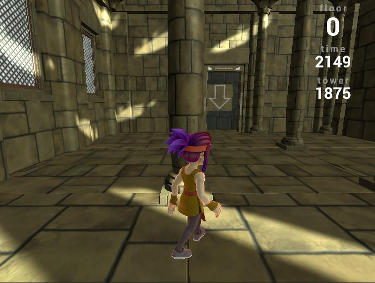

## Project Summary

TowerTamers is a reinforcement learning (RL) project focused on training an agent to navigate the Obstacle Tower environment, a 3D procedurally generated tower with increasing difficulty. We implement a custom Proximal Policy Optimization (PPO) algorithm enhanced with frame stacking and reward shaping to improve exploration and movement, alongside a Stable-Baselines3 PPO baseline for comparison. Our goal is to enable the agent to climb floors effectively, adapting to the environment's challenges using both tailored and off-the-shelf RL techniques.

## Approach

Our approach centers on Proximal Policy Optimization (PPO), a policy gradient method balancing stability and sample efficiency. The algorithm samples actions from a policy π(a|s), optimizing a clipped surrogate loss: `-min(r_t * A_t, clip(r_t, 1-ε, 1+ε) * A_t)` where `r_t = π(a_t|s_t) / π_old(a_t|s_t)`, `A_t` is the Generalized Advantage Estimate (GAE), and `ε=0.1`. The value function minimizes `MSE(V(s_t), R_t)`, where `R_t` is the discounted return, and we add an entropy bonus `-0.01 * H(π)` to encourage exploration [Schulman et al., 2017]. In our custom implementation (src/train.py), the agent processes 4 stacked RGB frames as input (shape `[12, 84, 84]`), outputs one of 54 discrete actions via an ActionFlattener for the MultiDiscrete action space (movement, rotation, jump, interaction), and uses rewards shaped with +0.01 for walking (move_idx != 0) and -0.005 for jumping (jump_idx == 1). The network architecture includes four convolutional layers reducing `[12, 84, 84]` to `[64, 5, 5]`, followed by a 1024-unit FC layer. We train for up to 1M steps with hyperparameters: learning rate=1e-4, epochs=10, batch_size=128, tuned from defaults for stability. The Stable-Baselines3 version (src/train2.py) uses "MlpPolicy", flattening observations to `[21168]` due to time constraints, with default settings adjusted similarly.

## Evaluation

We evaluated both our custom PPO (src/train.py) and Stable-Baselines3 PPO (src/train2.py). For the custom PPO, we ran ~10k steps, logging episode rewards that plateau at 1.0 or 0.0, indicating sparse feedback (see plot below). Qualitatively, the agent jumps often with occasional walking but rarely progresses (screenshot below). For Stable-Baselines3, we ran ~10k steps with "MlpPolicy", logging rewards via TensorBoard (see below). Rewards similarly hover around 0.0-1.0, suggesting both implementations struggle with exploration and reward sparsity. Setup used real-time mode (--realtime) on a single Obstacle Tower instance.

*Figure 1: Episode rewards for custom PPO over ~10k steps, plateauing at 1.0 or 0.0.*

*Figure 2: Screenshot of the custom PPO agent, often jumping without progress.*

*Figure 3: Episode rewards for Stable-Baselines3 PPO, showing similar low performance.*

## Remaining Goals and Challenges

Our prototype demonstrates a working RL pipeline but is limited by low rewards and incomplete evaluation. Goals for the final report include refining the reward function (e.g., adding distance-based rewards for climbing), switching to "CnnPolicy" in Stable-Baselines3 for better image processing, and extending training to 100k+ steps for deeper insights. We also aim to quantify success rate (e.g., floors climbed) and compare custom vs. Stable-Baselines3 performance. Challenges include frequent Unity crashes, possibly due to resource constraints (memory/CPU), which disrupt training continuity—mitigation might involve reducing frame stack size or debugging Unity logs. Slow learning, expected to some degree with sparse rewards, could be addressed with hyperparameter tuning (e.g., larger clip range), though time limits this exploration. Finally, comprehensive evaluation requires more runs, challenging under today’s deadline but planned for later.

## Resources Used

Key resources include:
- Obstacle Tower Environment (https://github.com/Unity-Technologies/obstacle-tower-env) - Core environment.
- Stable-Baselines3 Docs (https://stable-baselines3.readthedocs.io/) - Baseline PPO guidance.
- PyTorch Docs (https://pytorch.org/docs/stable/index.html) - Neural network implementation.
- Schulman et al., 2017 (https://arxiv.org/abs/1707.06347) - PPO algorithm details.
